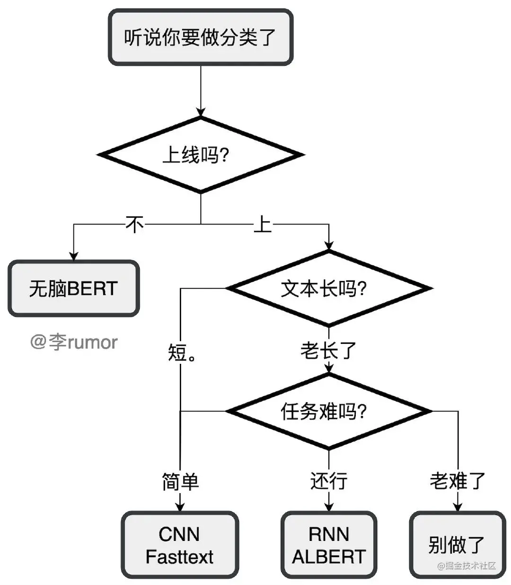

# 文本分类任务

近年来随着深度学习的发展，模型参数的数量飞速增长。为了训练这些参数，需要更大的数据集来避免过拟合。然而，对于大部分NLP任务来说，
构建大规模的标注数据集非常困难（成本过高），特别是对于句法和语义相关的任务。相比之下，大规模的未标注语料库的构建则相对容易。
为了利用这些数据，我们可以先从其中学习到一个好的表示，再将这些表示应用到其他任务中。最近的研究表明，基于大规模未标注语料库
的预训练模型（Pretrained Models, PTM) 在NLP任务上取得了很好的表现。

大量的研究表明基于大型语料库的预训练模型（Pretrained Models, PTM）可以学习通用的语言表示，有利于下游NLP任务，同时能够避免
从零开始训练模型。随着计算能力的发展，深度模型的出现（即 Transformer）和训练技巧的增强使得 PTM 不断发展，由浅变深。

  

本图片来自于：https://github.com/thunlp/PLMpapers

本示例展示了如何以BERT([Bidirectional Encoder Representations from Transformers](https://arxiv.org/abs/1810.04805))预
训练模型Finetune完成多标签文本分类任务。

## 教程列表

- [01_机器学习分类模型.ipynb](01_机器学习分类模型.ipynb)
- [02_深度学习分类模型.ipynb](02_深度学习分类模型.ipynb)
- [03_Bert文本分类.ipynb](03_Bert文本分类.ipynb)
- [04_应用_姓名识别国籍.ipynb](04_应用_姓名识别国籍.ipynb)
- [AVG情感分析.py](sentiment_classification_avg.py)
- [RNN情感分析.py](sentiment_classification_rnn.py)
- [CNN情感分析.py](sentiment_classification_cnn.py)

## 分类模型调研

文本分类模型调研，模型比对有以下几个比较常用的：

1. LR，逻辑回归模型，简单实用，训练预测快速，在样本数据量大，不需要复杂的文本语义区分的情况下，是比较推荐的baseline，长短文本都适用。
2. Xgboost/lightgbm，树模型，可解释性强，支持类别类型和值类型，Kaggle比赛常用利器，好好调参可以达到比肩深度模型的效果，推荐xgboost+lr。
3. Fasttext，模型本身复杂度低，效果不错，文本长且速度要求高，可以作为baseline，如果要继续提升效果还需要更复杂的模型。
4. TextCNN，很适合中短文本场景，不太适合长文本，因为卷积核尺寸通常不会设很大，无法捕获长距离特征。max-pooling存在局限，会丢掉一些有用的特征。
5. BiLSTM+Attention，BiLSTM提取句子表示，再进行分类，加attention的套路用到CNN后代替pooling也可以，加attention可以提高2个点的效果。如果是情感分析这种由句子整体决定分类结果的任务首选lstm。
6. HAN，篇章级的文本分类，层次注意力分类框架，即Hierarchical Attention，先对每个句子用BiGRU+Att编码得到句向量，再对句向量用BiGRU+Att得到doc级别的表示进行分类。实验结果纸币avg、max池化提高不到一个点，不推荐。
7. Bert，预训练模型，也可以试试不同的预训练模型，比如RoBERT、WWM、ALBERT，在领域数据上finetune模型，模型蒸馏可以提升预测速度，先多任务训练模型，再迁移到自己任务也可以提高效果。

## 技巧

- 数据清洗
1. 去掉文本强pattern：比如做新闻主题分类，一些爬下来的数据中带有的XX报道、XX编辑高频字段就没有用，可以对语料的片段或词进行统计，把很高频的无用元素去掉。还有一些会明显影响模型的判断，比如之前我在判断句子是否为无意义的闲聊时，发现加个句号就会让样本由正转负，因为训练预料中的闲聊很少带句号（跟大家的打字习惯有关），于是去掉这个pattern就好了不少。
2. 纠正标注错误：算法同学背后实际是个标注员，简单的说就是把训练集和评估集拼起来，用该数据集训练模型两三个epoch（防止过拟合），再去预测这个数据集，把模型判错的拿出来按proba排序，少的话就自己看，多的话就反馈给标注人员，把数据质量搞上去了能提升好几个点。

- 长文本
1. 直接上Fasttext。
2. Bert模型，简单的方法是粗暴截断，比如只取句首+句尾、句首+tfidf筛几个词出来；或者每句都预测，最后对结果综合。
3. 魔改模型，如XLNet、Reformer、Longformer。

- 少样本
1. Bert模型，先训练一版模型，把分类问题转化为匹配问题，用训练的ber模型再去预测线上数据，然后再标注预测的高置信度结果，扩展样本数据。
2. 用自监督、半监督的方法。

- 鲁棒性
1. 数据增强，去停用词，去标点，随机增删词，同义词替换等。
2. 对抗学习、对比学习，GAN文本生成等。

- 模型选型

